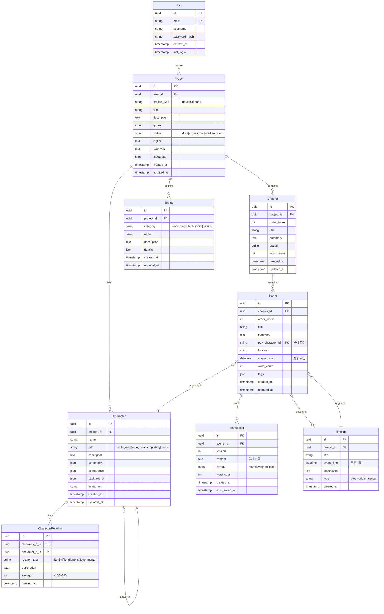

# StoryBuilder ERD (Entity Relationship Diagram)

> 작가용 IDE의 데이터 구조 설계

---

## 핵심 엔티티 관계도



---

## 계층 구조

```
User
 └─ Project (작품)
     ├─ Chapter (장)
     │   └─ Scene (씬)
     │       └─ Manuscript (원고 버전들)
     │
     ├─ Character (인물)
     │   └─ CharacterRelation
     │
     ├─ Timeline (타임라인)
     │
     └─ Setting (세계관 설정)
```

---

## 주요 관계 설명

### 1. 작품 계층 (Project → Chapter → Scene → Manuscript)
- **1:N 계층 구조**
- Scene = 최소 집필 단위 (보통 하나의 장소/시간)
- Manuscript = 실제 텍스트 버전 관리

### 2. 씬 ↔ 인물 (Many-to-Many)
- 씬에 등장하는 인물들
- POV(관점) 인물은 별도 FK로 명시

### 3. 인물 관계 (Self-referencing Many-to-Many)
- A ↔ B 양방향 관계
- 관계 강도 (-100 ~ +100)

### 4. 타임라인 ↔ 씬
- 작중 시간 순서 정렬
- 플롯/세계관/인물별 타임라인 분리 가능

---

## 인덱스 전략

```sql
-- 자주 조회되는 패턴
INDEX idx_chapter_project ON chapter(project_id, order_index);
INDEX idx_scene_chapter ON scene(chapter_id, order_index);
INDEX idx_scene_time ON scene(scene_time);
INDEX idx_character_project ON character(project_id);
INDEX idx_timeline_project_time ON timeline(project_id, event_time);

-- 전문검색
FULLTEXT INDEX idx_manuscript_content ON manuscript(content);
FULLTEXT INDEX idx_character_name ON character(name);
```

---

## 확장 가능성

### Phase 2
- `Collaboration` : 공동 작업
- `Comment` : 씬/원고 댓글
- `Version` : 브랜치/버전 관리

### Phase 3
- `Export` : 출판 포맷 변환 기록
- `AIAnalysis` : AI 분석 결과 캐시
- `Template` : 작품 템플릿

---

**설계 원칙**
1. Scene = 집필의 원자 단위
2. Manuscript = 버전별 분리 (Git처럼)
3. 모든 관계는 UUID (분산 가능)
4. JSON 필드로 유연성 확보
